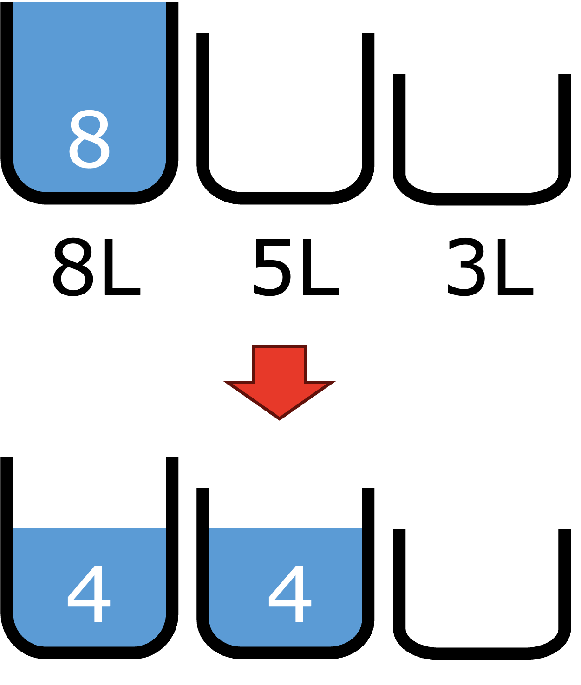

# Water pouring puzzle

</img>

You have 3 water jugs: one of 8 liters, one of 5 liters, and one of 3 liters.
Initially, the 8-liter jug is completely filled; the others are empty.
You can only pour water from one jug to another; you may not spill water or add new water.
No eyeballing volumes either: either you completely empty a jug, or you fill the other one up exactly to the rim.
Your goal is to end with 4 liters in both the 8- and 5-liter jugs, and nothing in the third.

Use TLA+ to model the state of this puzzle.
Check that your model never loses any water, nor that new water gets added.
Use the model checker to find a solution to the puzzle.
